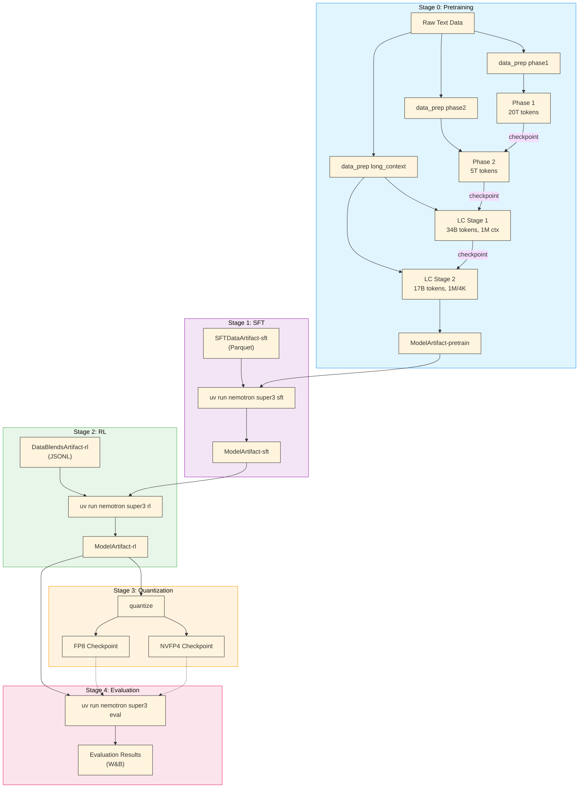

# Nemotron 3 Super Training Recipe

A complete, reproducible training pipeline for Nemotron 3 Super—an open, high-capacity Mixture-of-Experts hybrid Mamba-Transformer model with LatentMoE and multi-token prediction.

## Quick Start

### Prerequisites

- **Slurm cluster** with GPU nodes (B200 recommended for NVFP4 support) — see [Execution through NeMo-Run](../../nemo_runspec/nemo-run.md)
- **[Weights & Biases](../wandb.md) account** for experiment tracking and [artifact lineage](../../nemo_runspec/artifacts.md)
- **Container image**: `nvcr.io/nvidia/nemo:26.02.nemotron_3_super`

### Installation

```bash
git clone https://github.com/NVIDIA/nemotron
cd nemotron
uv sync
```

### Configuration

Create an `env.toml` file (see [Execution through NeMo-Run](../../nemo_runspec/nemo-run.md) for details):

```toml
[wandb]
project = "nemotron"
entity = "YOUR-TEAM"

[YOUR-CLUSTER]
executor = "slurm"
account = "YOUR-ACCOUNT"
partition = "batch"
nodes = 4
ntasks_per_node = 8
gpus_per_node = 8
mounts = ["/lustre:/lustre"]
```

### Run the Pipeline

<div class="termy">

```console
// Stage 0: Pretraining
$ uv run nemotron super3 data prep pretrain --run YOUR-CLUSTER
$ uv run nemotron super3 pretrain --run YOUR-CLUSTER

// Stage 1: Supervised Fine-Tuning
$ uv run nemotron super3 data prep sft --run YOUR-CLUSTER
$ uv run nemotron super3 sft --run YOUR-CLUSTER

// Stage 2: Reinforcement Learning
$ uv run nemotron super3 data prep rl --run YOUR-CLUSTER
$ uv run nemotron super3 rl --run YOUR-CLUSTER

// Stage 3: Evaluation
$ uv run nemotron super3 eval --run YOUR-CLUSTER
```

</div>

## Resources

- **Tech Report**: [Nemotron 3 Super Technical Report](https://research.nvidia.com/labs/nemotron/files/NVIDIA-Nemotron-3-Super-Technical-Report.pdf)
- **Model Weights**:
  - [NVIDIA-Nemotron-3-Super-120B-A12B-BF16](https://huggingface.co/nvidia/NVIDIA-Nemotron-3-Super-120B-A12B-BF16) (Post-trained model)
  - [NVIDIA-Nemotron-3-Super-120B-A12B-FP8](https://huggingface.co/nvidia/NVIDIA-Nemotron-3-Super-120B-A12B-FP8) (FP8 quantized)
  - [NVIDIA-Nemotron-3-Super-120B-A12B-NVFP4](https://huggingface.co/nvidia/NVIDIA-Nemotron-3-Super-120B-A12B-NVFP4) (NVFP4 quantized)
  - [NVIDIA-Nemotron-3-Super-120B-A12B-Base-BF16](https://huggingface.co/nvidia/NVIDIA-Nemotron-3-Super-120B-A12B-Base-BF16) (Base model)
- **Training Datasets**:
  - [Nemotron-Pretraining-Specialized-v1.1](https://huggingface.co/datasets/nvidia/Nemotron-Pretraining-Specialized-v1.1) (Synthetic pretraining data)
- **Megatron-Bridge Docs**: [Nemotron 3 Super](https://github.com/NVIDIA-NeMo/Megatron-Bridge/blob/super-v3/docs/models/llm/nemotron3-super.md)

## Training Pipeline

| Stage | Name | Purpose | Guide |
|-------|------|---------|-------|
| 0 | [Pretraining](./pretrain.md) | Base model training on 25T tokens with LatentMoE and MTP | [pretrain.md](./pretrain.md) |
| 1 | [SFT](./sft.md) | Multi-domain instruction tuning with two-stage loss | [sft.md](./sft.md) |
| 2 | [RL](./rl/index.md) | Multi-environment RLVR + SWE-RL + RLHF alignment | [rl/](./rl/index.md) |
| 3 | [Quantization](./quantization.md) | FP8 and NVFP4 post-training quantization | [quantization.md](./quantization.md) |
| — | Distillation | Knowledge distillation (see tech report) | Coming soon |
| 4 | [Evaluation](./evaluate.md) | Benchmark evaluation across 20+ benchmarks | [evaluate.md](./evaluate.md) |

## Architecture


## Model Specifications

| Specification | Value |
|---------------|-------|
| **Total Parameters** | 120.6B |
| **Active Parameters** | 12.7B (per forward pass) |
| **Pretraining Tokens** | 25 trillion |
| **Context Length** | Up to 1M tokens |
| **Architecture** | Hybrid Mamba-Transformer with LatentMoE and MTP |
| **Layers** | 88 (periodic Mamba-MoE interleaving with attention anchors) |
| **Model Dimension** | 4096 |
| **Total Experts per Layer** | 512 |
| **Active Experts (Top-k)** | 22 |
| **MoE Latent Dimension** | 1024 |
| **MTP Layers** | 2 (shared weight) |
| **Precision** | BF16 mixed (NVFP4 for pretrain on B200) |

> For architecture details, see the [Tech Report](https://research.nvidia.com/labs/nemotron/files/NVIDIA-Nemotron-3-Super-Technical-Report.pdf).

## Stage Summaries

### Stage 0: Pretraining

Two-phase curriculum on 25 trillion tokens: Phase 1 (20T, 80%) focuses on diversity across 16 data categories; Phase 2 (5T, 20%) emphasizes high-quality sources. Introduces LatentMoE for hardware-aware sparse scaling, MTP for inference acceleration, and checkpoint merging for quality tracking during the stable LR phase. Includes long-context extension to 1M tokens.

> [Pretraining Guide](./pretrain.md)

### Stage 1: Supervised Fine-Tuning

Multi-domain instruction tuning over 7M samples covering 15+ data domains including competition math/code, software engineering, agentic programming, CUDA, financial reasoning, long context, safety, search, terminal use, SQL, and more. Uses a novel two-stage SFT loss (token-level then sample-level) and continues MTP training from pretraining. Supports three reasoning modes: reasoning-off, regular, and low-effort.

> [SFT Guide](./sft.md)

### Stage 2: Reinforcement Learning

Three-stage RL pipeline: (1) multi-environment RLVR across 21 environments and 37 datasets covering math, code, STEM, safety, agentic tasks, and reasoning gym; (2) SWE-RL for end-to-end software engineering using OpenHands with Apptainer containers; (3) RLHF with a principle-following GenRM (Qwen3-235B initialization).

> [RL Guide](./rl/index.md)

### Stage 3: Quantization

Post-training quantization producing FP8 (Hopper) and NVFP4 (Blackwell) checkpoints. NVFP4 uses a hybrid PTQ recipe with AutoQuantize mixed-precision NAS achieving 99.8% median accuracy vs BF16. Includes QAD (Quantization-Aware Distillation) and Mamba state quantization with FP16 stochastic rounding.

> [Quantization Guide](./quantization.md)

### Stage 4: Evaluation

Comprehensive evaluation across general knowledge (MMLU-Pro), reasoning (AIME25, HMMT, GPQA, LiveCodeBench, SciCode, HLE), agentic (TerminalBench, SWE-Bench with 3 harnesses, TauBench V2, BrowseComp, BIRD), chat & IF (IFBench, Multi-Challenge, Arena-Hard-V2), long context (AA-LCR, RULER at 256K/512K/1M), and multilingual (MMLU-ProX, WMT24++).

> [Evaluation Guide](./evaluate.md)

## Execution Options

All commands support [NeMo-Run](../../nemo_runspec/nemo-run.md) execution modes:

| Option | Behavior | Use Case |
|--------|----------|----------|
| `--run <profile>` | Attached—submits job and streams logs | Interactive development |
| `--batch <profile>` | Detached—submits and exits immediately | Long-running jobs |
| `--dry-run` | Preview execution plan | Validation |

See [Execution through NeMo-Run](../../nemo_runspec/nemo-run.md) for profile configuration and advanced options.

## Artifact Lineage

The pipeline tracks full lineage via [W&B Artifacts](../../nemo_runspec/artifacts.md), enabling traceability from raw data to final model.



> [Artifact Lineage & W&B Integration](../../nemo_runspec/artifacts.md)

## Open-Source Data

> **Note**: These recipes train exclusively on the open-sourced subset of training data. Results will differ from the tech report benchmarks, which used additional proprietary data. Use these recipes as reference implementations to apply the methodology with your own data.

## CLI Reference

<div class="termy">

```console
// Show available commands
$ uv run nemotron super3 --help
Usage: nemotron super3 [OPTIONS] COMMAND [ARGS]...

 Super3 training recipe

╭─ Commands ───────────────────────────────────────────────────────────────╮
│ data       Data curation and preparation commands                        │
│ model      Model evaluation and import commands                          │
╰──────────────────────────────────────────────────────────────────────────╯
╭─ Training Stages ────────────────────────────────────────────────────────╮
│ pretrain   Run pretraining with Megatron-Bridge (stage0).                │
│ sft        Run supervised fine-tuning with Megatron-Bridge (stage1).     │
│ rl         Run reinforcement learning with NeMo-RL GRPO (stage2).        │
│ eval       Run evaluation with NeMo-Evaluator (stage4).                  │
╰──────────────────────────────────────────────────────────────────────────╯
```

</div>

## Troubleshooting

**W&B authentication**: See [W&B Integration](../wandb.md) for setup.
```bash
wandb login
```

**Container not found**: Verify image path in config files.

**Job submission fails**: Check Slurm account and partition in `env.toml`. See [Execution through NeMo-Run](../../nemo_runspec/nemo-run.md).

## Further Reading

- [Stage 0: Pretraining](./pretrain.md)
- [Stage 1: SFT](./sft.md)
- [Stage 2: RL](./rl/index.md)
- [Stage 3: Quantization](./quantization.md)
- [Stage 4: Evaluation](./evaluate.md)
- [Artifact Lineage](../../nemo_runspec/artifacts.md)
- [Execution through NeMo-Run](../../nemo_runspec/nemo-run.md)
- [W&B Integration](../wandb.md)
- [NVIDIA AI Stack](../nvidia-stack.md)
- [Execution through NeMo-Run](../../nemo_runspec/nemo-run.md)
- [Data Preparation Module](../data-prep.md)
